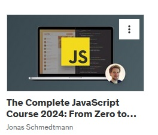
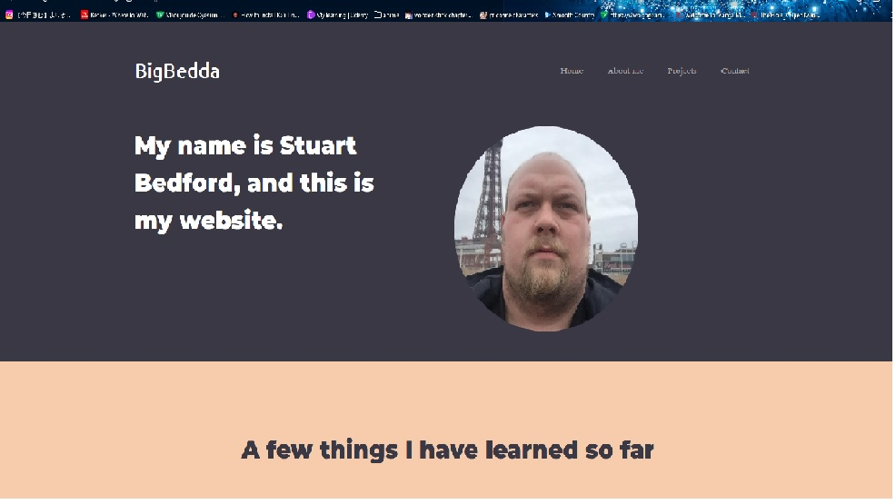

# Learn and be curious

**Star method and description**

**S** - Giving up my career as a truck driver to pursure as career in tech, partially because of neccessity but mainly because tech is what i'm passionate about and it was very much time to go looking for a new challenge.

**T** - Making the decision to move into tech is one thing, but narrowing down the possibilities and looking for something to specialise in/ aim for to start was a whole new challenge I've had to face, faced with sure a large array of potential avenues of tech to choose from my goal is now to narrow the field down and focus more on certain types of career in tech, wether that be in cyber security, software development or web development

**A** - The steps that I have taken so far mainly revolve around learning more, going back to college to take on functional skills maths and english as I didn't have them at GCSE grade C level, with the possibility that I could use that to take on an apprenticeship in the near future, puchasing courses on udemy like the full stack web dev course, the complete zero to here javascript course along side courses like ones for react and linux that I still need to start, having a playlist full of learning material that could be of use, and the main one, joining a certified course where I can get hands on experience with a bunch of things I may never have thought to try, the AWS cloud architecture. spending 12 weeks learning all about it alongside my own personal learning in other areas(mainly web dev) during my free time on weekends

**R** - The outcome of all this up to this point is that I have gained a huge amount of knowledge about various things in the tech space, not enough knowledge just yet to take into a full time job but enough to start to have basic understanding of how a lot of different aspects of IT work, ranging from websites, to software (like OS and games) to then seeing behind the curtain and dipping my toes into trying to work on building my own projects, all very very basic as of right now but with time and more knowledge I will be able to fully flesh them out

