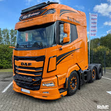

# STAR METHOD

**Situation**
My truck was loaded with a weeks worth of deliveries to be delievered around the country

**Task**
Get all the deliveries done and get back to the yard by friday afternoon/evening

**Actions**
Spent a couple of hours on the truck sat nav inputting each and every postcode, then arranging the postcodes in an order that would make the deliveries much easier (i.e same areas, not passing one delivery just to come back to it later)

**Results**
A week spent out in the truck, all deliveries made and returned home on friday afternoon,

